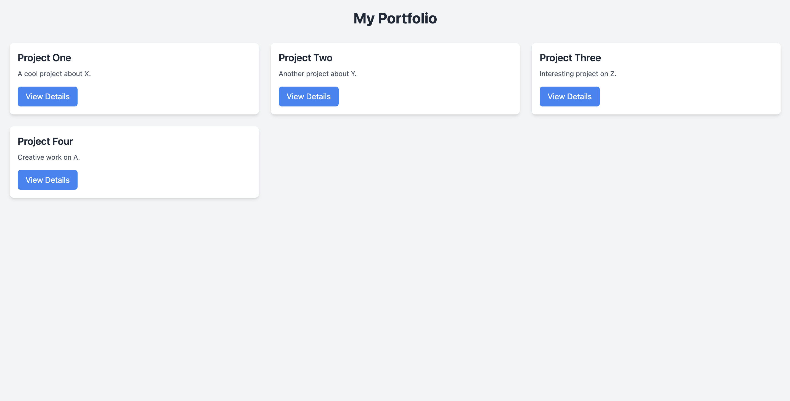
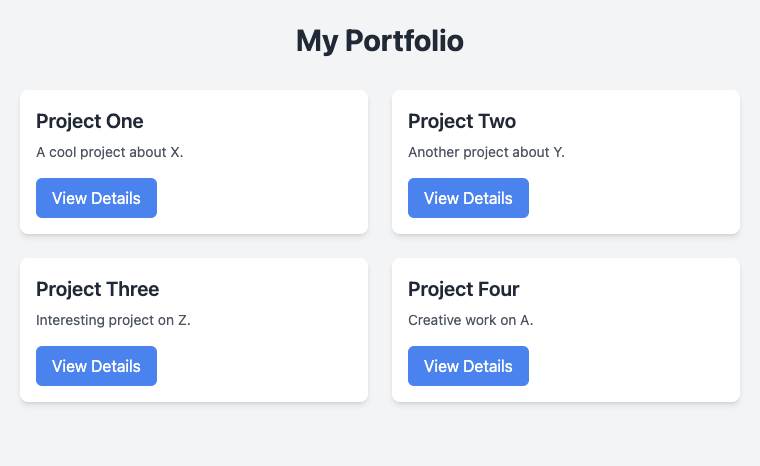
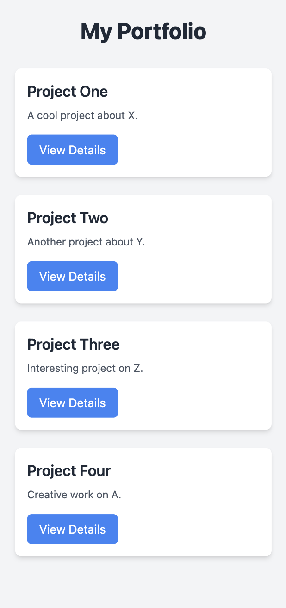

# Tailwind CSS in React with Responsive Design

## Objective:

Learn how to use Tailwind CSS for styling a React application with a focus on responsive design. The mini project will be a Responsive Portfolio Section, featuring cards that adapt to different screen sizes.

## Mini Project: Responsive Portfolio Section
Features:

- Build a responsive grid of portfolio cards using Tailwind's utility-first classes.
- The layout adapts to different screen sizes (mobile, tablet, desktop).
- Cards include a title, description, and button for more details.

## Screenshots

Large Screen

Medium Screen

Small Screen
